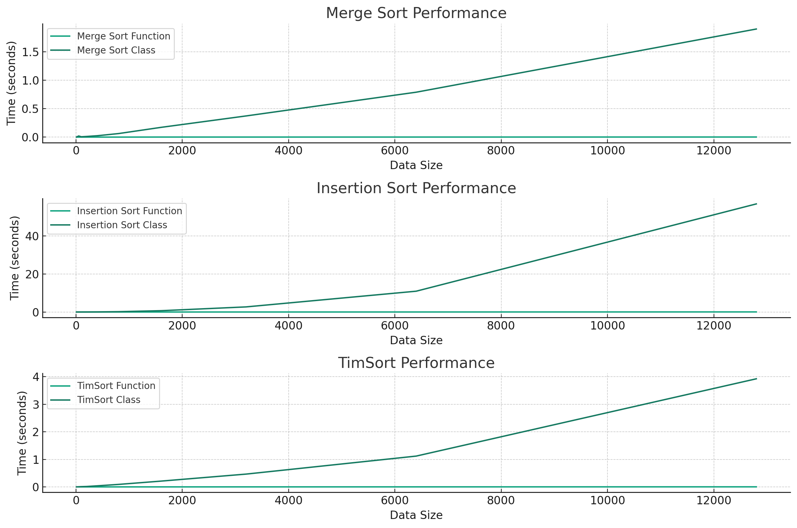

Result
    Data Size  Merge Sort Function Time  Merge Sort Class Time  \
0          10                    0.0001                 0.0031   
1          20                    0.0000                 0.0067   
2          50                    0.0000                 0.0199   
3         100                    0.0001                 0.0063   
4         200                    0.0001                 0.0115   
5         400                    0.0004                 0.0243   
6         800                    0.0004                 0.0623   
7        1600                    0.0012                 0.1713   
8        3200                    0.0010                 0.3717   
9        6400                    0.0012                 0.7881   
10      12800                    0.0019                 1.8968   

    Insertion Sort Function Time  Insertion Sort Class Time  \
0                         0.0001                     0.0016   
1                         0.0000                     0.0044   
2                         0.0000                     0.0011   
3                         0.0001                     0.0035   
4                         0.0003                     0.0110   
5                         0.0008                     0.0468   
6                         0.0007                     0.1754   
7                         0.0007                     0.6882   
8                         0.0028                     2.6864   
9                         0.0109                    10.9411   
10                        0.0441                    56.8539   

    TimSort Function Time  TimSort Class Time  Merge Sort Percentage Increase  \
0                  0.0001              0.0009                    3.000000e+03   
1                  0.0000              0.0014                             inf   
2                  0.0000              0.0042                             inf   
3                  0.0000              0.0091                    6.200000e+03   
4                  0.0000              0.0145                    1.140000e+04   
5                  0.0001              0.0385                    5.975000e+03   
6                  0.0002              0.0902                    1.547500e+04   
7                  0.0003              0.2100                    1.417500e+04   
8                  0.0005              0.4646                    3.707000e+04   
9                  0.0010              1.1179                    6.557500e+04   
10                 0.0022              3.9238                    9.973158e+04   

    Insertion Sort Percentage Increase  TimSort Percentage Increase  
0                         1.500000e+03                 8.000000e+02  
1                                  inf                          inf  
2                                  inf                          inf  
3                         3.400000e+03                          inf  
4                         3.566667e+03                          inf  
5                         5.750000e+03                 3.840000e+04  
6                         2.495714e+04                 4.500000e+04  
7                         9.821429e+04                 6.990000e+04  
8                         9.584286e+04                 9.282000e+04  
9                         1.002771e+05                 1.116900e+05  
10                        1.288204e+05                 1.782545e+05  

